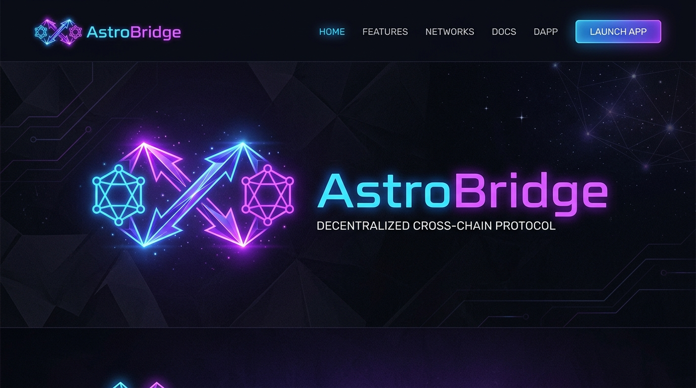
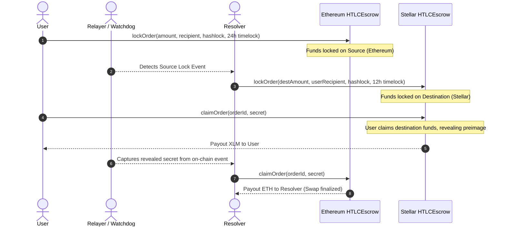

# AstroBridge 💫



> Non-custodial cross-chain atomic swap — Ethereum · Stellar · Solana  
> **No validator set. No attester. No admin escape hatch.**

[](https://github.com/Waffle-finance/waffle-finance-core/actions/workflows/ci.yml)
[](https://opensource.org/licenses/MIT)

---

## 💡 What it is

AstroBridge locks funds in **Hash Time-Lock Contracts (HTLCs)** on each chain simultaneously. Settlement is a sha256 preimage reveal — not a multisig, not an attester signature.

If anything fails — coordinator down, resolver offline, RPC unavailable, frontend unreachable — locked funds either settle to the beneficiary or refund permissionlessly to the user. There is no state where funds are stuck under operator control.

**Status**: Live on testnet (Sepolia + Stellar testnet). Solana support is live in simulation mode — full settlement activates once the Anchor HTLC program is deployed on devnet. Mainnet gated until independent audit (Q1 2027).

### Supported chains

| Chain | Asset | Status |
|---|---|---|
| Ethereum (Sepolia) | ETH | ✅ Live |
| Stellar | XLM | ✅ Live |
| Solana | SOL | 🟡 Simulation mode (Anchor program pending deployment) |

---

## ⚙️ How it works

AstroBridge coordinates atomic swaps by aligning lock transactions on both the source and destination leg. A 12h vs 24h timelock gap protects both parties from double-spend or capital lockups.



Both legs settle, or both legs refund. The 12h vs 24h timelock gap ensures the resolver's destination refund always expires before the user's source — so neither party can ever be stuck.

### Trust model

Funds move under exactly two conditions:
1. A caller submits a preimage where `sha256(preimage) == hashlock` before timelock — funds go to beneficiary.
2. Timelock has expired — anyone calls `refundOrder` and funds return to `refundAddress` (always the original user).

**Robust native-ETH payout**: A beneficiary / refundAddress that is a smart contract may revert on receipt or exhaust the bounded gas stipend. Rather than letting that block a settlement backed by a valid preimage or an expired timelock, `HTLCEscrow` attempts a direct push and, if it fails, credits the amount to the recipient's pull-payment balance instead of reverting. The claim/refund still finalises (the preimage is revealed on-chain either way), and the recipient — and only that recipient — recovers the funds permissionlessly via `withdraw()`. This adds no custodial surface: credited funds are never pooled or operator-movable, and `withdraw()` can only return a caller's own balance, never locked order funds.

The coordinator is a metadata service that never signs transactions touching user funds. Resolvers stake into `ResolverRegistry`; misbehaviour is slashable on-chain.

| Attack vector | Validator-set bridge | AstroBridge |
|---|---|---|
| Compromise off-chain signers | Funds lost | No effect — no signers |
| Compromise first-party attester | Funds lost | No effect — no attesters |
| Break sha256 | Safe | Funds at risk (breaks all of crypto) |
| Compromise chain consensus | Funds at risk | Funds at risk (inherited) |

---

## 📂 Repository Layout

```text
contracts/          Solidity — HTLCEscrow + ResolverRegistry (Ethereum)
soroban/            Rust — Soroban HTLC + ResolverRegistry (Stellar)
packages/
  sdk/              @astro-bridge/sdk — shared TS types, asset mappings, clients
  config/           @astro-bridge/config — Zod schema validation
coordinator/        Order book service (SQLite/Postgres, REST, never holds keys)
relayer/            Bridge relay service (watchdogs, events claims)
resolver/           Open-source resolver runner + Docker image
frontend/           React + Vite dApp (Ethereum · Stellar · Solana)
docs/               Technical documentation and debt register
```

---

## 🚀 Quick Start

1. Install dependencies:
   ```bash
   pnpm install
   ```
2. Copy environment file:
   ```bash
   cp env.example .env
   ```
3. Build shared SDK & config packages:
   ```bash
   pnpm build:config
   pnpm build:sdk
   ```
4. Run EVM tests:
   ```bash
   pnpm test:contracts
   ```
5. Run Soroban tests:
   ```bash
   cd soroban && cargo test && cd ..
   ```
6. Start coordinator & frontend:
   ```bash
   pnpm --filter @astro-bridge/coordinator dev
   pnpm --filter @astro-bridge/frontend dev
   ```

---

## 🛡️ Refund layers

| Layer | Trigger | Latency |
|---|---|---|
| On-chain HTLC refund | timelock expires; anyone calls `refundOrder` | ≤ 24h |
| Frontend refund dialog | "Refund" button in transaction history | User-driven |
| Automatic refund | Destination leg fails mid-request; relayer refunds inline | < 30s |
| Background watchdog | Swap pending > 5 min; background scanner fires | < 6 min |

Even with the coordinator, relayer, and frontend all offline, layer 1 alone is sufficient — the user calls `refundOrder` directly from any wallet.

## License
MIT. See LICENSE.
